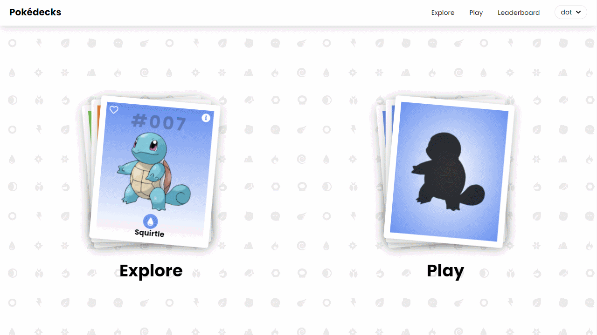

# Pokedecks

#### A pokédex in card style. Swipe through random pokemon cards or guess who's that pokemon.

 
 

# Built With

## Frontend

- [PokéAPI](https://pokeapi.co/)
- [React](https://reactjs.org/)
- [TypeScript](https://www.typescriptlang.org/)
- [Tailwind CSS](https://tailwindcss.com/)
- [react-query](https://react-query.tanstack.com/)
- [Framer](https://www.framer.com/api/motion/)
- [Pokemon Assets from HybridShivam](https://github.com/HybridShivam/Pokemon)
- [Firebase-Auth](https://firebase.google.com/docs/auth)

## Backend

- [NodeJS](https://nodejs.org/en/)
- [ExpressJS](https://expressjs.com/)
- [MongoDB](https://www.mongodb.com/)
- [Mongoose](https://mongoosejs.com/)

 
 

#### Backend Repo
[https://github.com/kitharvey/pokedecksbackend](https://github.com/kitharvey/pokedecksbackend)