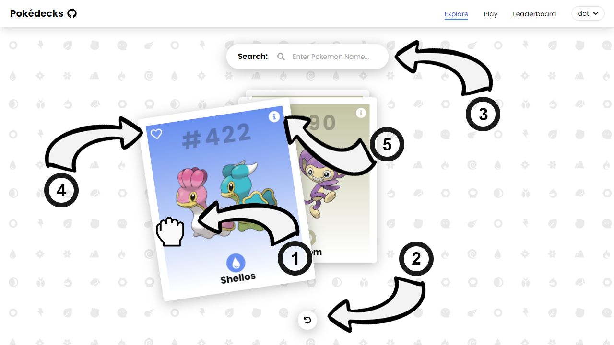
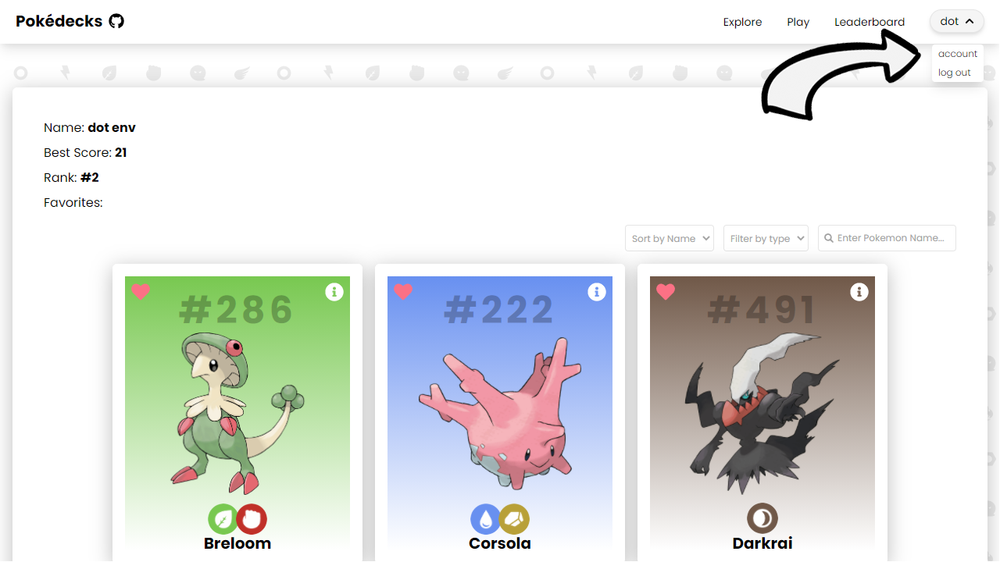

<br />
<p align="center">
    

  <h1 align="center">Pokedecks</h1>

  <p align="center">
    A pokédex in card style. Explore and swipe through random pokémon cards and play "who's that pokémon?".
    <br />
    <a href="https://github.com/kitharvey/pokedecks/blob/main/README.md"><strong>Explore the docs »</strong></a>
    <br />
    <br />
    <a href="https://poke-decks.vercel.app/" target="_blank" >View Demo</a>
    ·
    <a href="https://github.com/kitharvey/pokedecks/issues" target="_blank" >Report Bug</a>
    ·
    <a href="https://github.com/kitharvey/pokedecks/issues" target="_blank" >Request Feature</a>
    ·
    <a href="https://github.com/kitharvey/pokedecks/blob/main/How_its_made.md" target="_blank" >How it's made?</a>
  </p>
</p>

<!-- TABLE OF CONTENTS -->
<details open="open">
  <summary>Table of Contents</summary>
  <ol>
    <li>
      <a href="#about-the-project">About The Project</a>
      <ul>
        <li><a href="#built-with">Built With</a></li>
      </ul>
    </li>
    <li>
      <a href="#getting-started">Getting Started</a>
      <ul>
        <li><a href="#prerequisites">Prerequisites</a></li>
        <li><a href="#installation">Installation</a></li>
      </ul>
    </li>
    <li><a href="#usage">Usage</a></li>
    <li><a href="#roadmap">Roadmap</a></li>
    <li><a href="#contact">Contact</a></li>
    <li><a href="#acknowledgements">Acknowledgements</a></li>
  </ol>
</details>

<br />
<br />

<!-- ABOUT THE PROJECT -->

## About The Project


There are many great pokédex apps online but I found most of them are similarly built, displayed in a grid, scroll and click a pokémon to view more details about it. So I build my own but in a different style.

No mobile version yet.

Features:

- Swipe pokémon cards to explore
- Add to favorites
- Play "who's that pokémon?"
- Climb the leaderboard

Of course, I will be adding more soon or you can <a href="https://github.com/kitharvey/pokedecks/issues" target="_blank" >request a feature</a>.

<br />
<br />

### Built With

Frontend

- [PokéAPI](https://pokeapi.co/)
- [React](https://reactjs.org/)
- [TypeScript](https://www.typescriptlang.org/)
- [Tailwind CSS](https://tailwindcss.com/)
- [react-query](https://react-query.tanstack.com/)
- [Framer](https://www.framer.com/api/motion/)
- [pokémon Assets from HybridShivam](https://github.com/HybridShivam/pokémon)
- [Firebase-Auth](https://firebase.google.com/docs/auth)

Backend [Repo](https://github.com/kitharvey/pokedecksbackend)

- [NodeJS](https://nodejs.org/en/)
- [ExpressJS](https://expressjs.com/)
- [MongoDB](https://www.mongodb.com/)
- [Mongoose](https://mongoosejs.com/)

<br />
<br />

<!-- GETTING STARTED -->

## Getting Started

To get a local copy up and running follow these simple example steps.

### Prerequisites

This is an example of how to list things you need to use the software and how to install them.

- yarn
  ```sh
  npm install --global yarn
  ```

### Installation

**Set up client**

1. Clone the frontend repo for client
   ```sh
   git clone https://github.com/kitharvey/pokedecks.git
   ```
2. Go to project directory
   ```sh
   cd pokedecks
   ```
3. Install NPM packages
   ```sh
   yarn
   ```
4. Create `.env` file and add server url
   ```js
   REACT_APP_BACKEND_SERVER_URL = "http://localhost:5000";
   ```
5. Create a firebase web app and add Firebase SDK to `.env` file
   ```js
   REACT_APP_API_KEY = "xxxxxxxxxxxxxxxxxxxxxxxx";
   REACT_APP_AUTH_DOMAIN = "your_firebase_app.firebaseapp.com";
   REACT_APP_PROJECT_ID = "your_firebase_app";
   REACT_APP_STORAGE_BUCKET = "your_firebase_app.appspot.com";
   REACT_APP_MESSAGING_SENDER_ID = "101010101010";
   REACT_APP_APP_ID = "xxxxxxxxxxxxxxxxxxxxxxxx";
   ```
6. Start the application
   ```sh
   yarn start
   ```

**Set up server**

7. Go to home directory
   ```sh
   cd ..
   ```
8. Clone the backend repo for server
   ```sh
   git clone https://github.com/kitharvey/pokedecksbackend.git
   ```
9. Go to project directory
   ```sh
   cd pokedecksbackend
   ```
10. Install NPM packages
    ```sh
    yarn
    ```
11. Create `.env` file
12. Create MongoDB Atlas account, set up your database and add MONGODB_URI to `.env`
    ```js
    MONGODB_URI = xxxxxxxxxxxxxxxxxxxxxxxx;
    ```
13. Start the server, "http://localhost:5000"
    ```sh
    yarn dev
    ```

<br />
<br />

<!-- USAGE EXAMPLES -->

## Usage

**How to signin?**


1. Go to Sign In page.
2. Sign in with Google or Github.
3. You'll be redirected to the dashboard.

<br />

**How to explore?**



1. Swipe/Drag the cards to see the next card.
2. Click the undo button to go back to the previous card.
3. Enter the pokémon name to search.
4. Click the heart icon to add/remove the pokemon card to/from your favorites.
5. Click the information icon to see more details about the pokemon.

<br />

**How to play?**


1. Guess the pokémon.
2. You have 4 options to choose which is the correct pokémon name.
3. Guess the correct answer and your score will increment by one.
4. Pick the wrong answer and your lives will decrement by one.
5. You only have 3 lives.
6. Score as many as you can before your lives run out.
7. Only your best score will be recorded on the leaderboard.

<br />

**How to check account?**



1. Click your name on the top right of the dashboard, then click account.
2. Check your details and favorite.
   - Sort or filter your favorite pokémons.
   - Click the delete button at the bottom to delete your account.

<br />
<br />

<!-- ROADMAP -->

## Roadmap

See the [open issues](https://github.com/kitharvey/pokedecks/issues) for a list of proposed features (and known issues).

<br />
<br />

<!-- CONTACT -->

## Contact

Kit Harvey - [linkedIn](https://www.linkedin.com/in/kitharvey/)

Project Link: [https://github.com/kitharvey/pokedecks](https://github.com/kitharvey/pokedecks)

<br/>
<br/>
